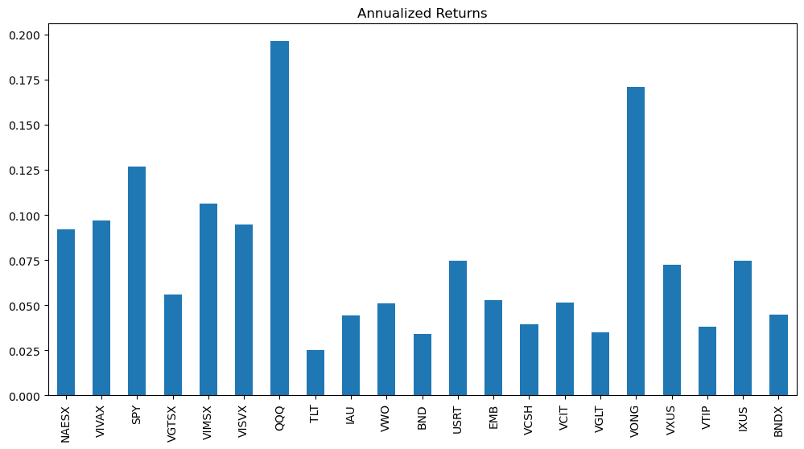
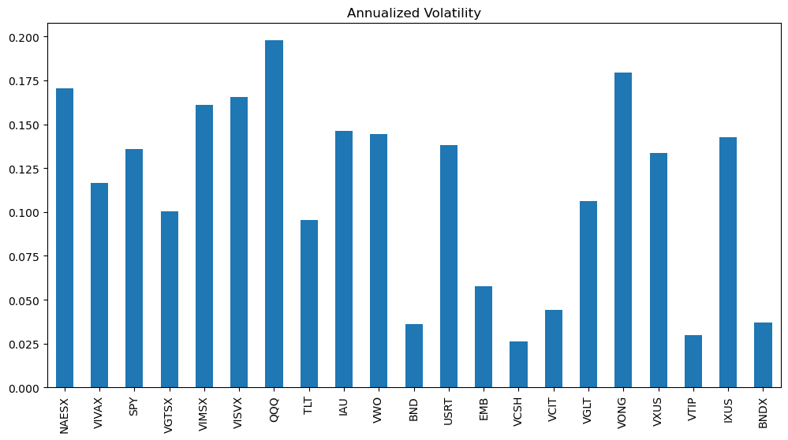
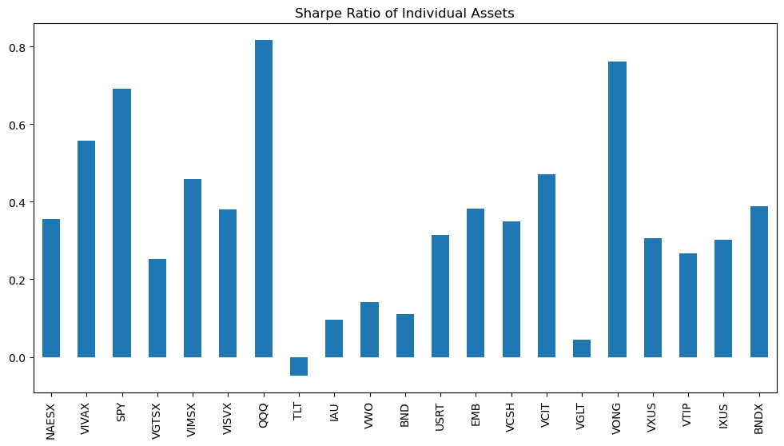
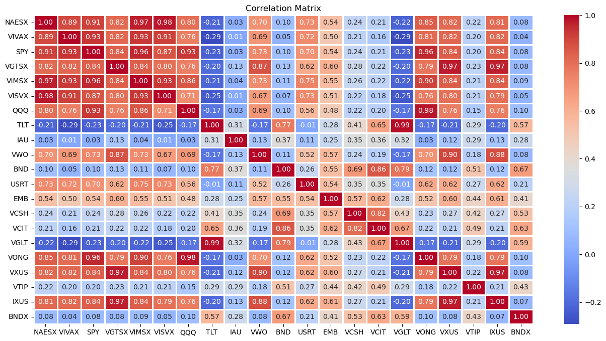
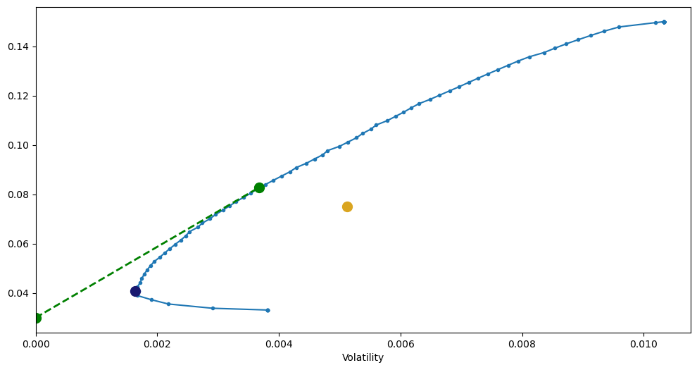
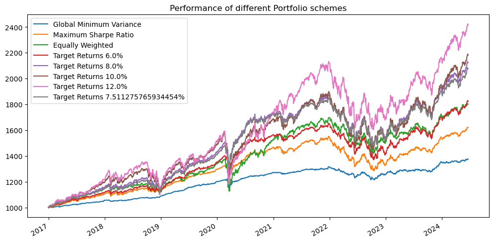

# Portfolio Construction and Analysis
## Objectives
1. Select some assets based on their historical performances as portfolio.
2. Execute the trades using IBKR API


```python
%load_ext autoreload
%autoreload 2
%matplotlib inline

import pandas as pd
import numpy as np
import matplotlib.pyplot as plt
import yfinance as yf
import sys
sys.path.insert(0, r'C:\Users\user\Documents\GitHub\Portfolio-Construction-and-Analysis\python_files')
import functions_1 as fnc
from ib_insync import *
util.startLoop()
```

## Assets
First I will select the assets I want in my portfolio, this will be done manually although there can be advanced methods of doing this but right now I don't know how to do it and it's not my goal too, so I will first select a bunch of ETFs from Yahoo Finance and then check their previous performances and run a backtest too


```python
tickers = ['VGTSX', 'VIMSX', 'VIVAX', 'VISVX', 'NAESX', 'VWO', 'SPY', 'USRT', 'IAU', 'VGLT', 'VONG', 'IXUS', 'VCSH', 'VTIP',
            'VCIT', 'TLT', 'BNDX', 'QQQ', 'BND', 'VXUS', 'EMB']
r_d_all = fnc.get_returns_data(tickers=tickers, replace_tickers=None, interval='1d', dividends=True)
```


```python
r_d_all.index = pd.to_datetime(r_d_all.index.date)
```


```python
r_d_all
```


<div>

<table border="1" class="dataframe">
  <thead>
    <tr style="text-align: right;">
      <th></th>
      <th>VGTSX</th>
      <th>VIMSX</th>
      <th>VIVAX</th>
      <th>VISVX</th>
      <th>NAESX</th>
      <th>VWO</th>
      <th>SPY</th>
      <th>USRT</th>
      <th>IAU</th>
      <th>VGLT</th>
      <th>...</th>
      <th>IXUS</th>
      <th>VCSH</th>
      <th>VTIP</th>
      <th>VCIT</th>
      <th>TLT</th>
      <th>BNDX</th>
      <th>QQQ</th>
      <th>BND</th>
      <th>VXUS</th>
      <th>EMB</th>
    </tr>
  </thead>
  <tbody>
    <tr>
      <th>1980-01-03</th>
      <td>NaN</td>
      <td>NaN</td>
      <td>NaN</td>
      <td>NaN</td>
      <td>0.000000</td>
      <td>NaN</td>
      <td>NaN</td>
      <td>NaN</td>
      <td>NaN</td>
      <td>NaN</td>
      <td>...</td>
      <td>NaN</td>
      <td>NaN</td>
      <td>NaN</td>
      <td>NaN</td>
      <td>NaN</td>
      <td>NaN</td>
      <td>NaN</td>
      <td>NaN</td>
      <td>NaN</td>
      <td>NaN</td>
    </tr>
    <tr>
      <th>1980-01-04</th>
      <td>NaN</td>
      <td>NaN</td>
      <td>NaN</td>
      <td>NaN</td>
      <td>0.000000</td>
      <td>NaN</td>
      <td>NaN</td>
      <td>NaN</td>
      <td>NaN</td>
      <td>NaN</td>
      <td>...</td>
      <td>NaN</td>
      <td>NaN</td>
      <td>NaN</td>
      <td>NaN</td>
      <td>NaN</td>
      <td>NaN</td>
      <td>NaN</td>
      <td>NaN</td>
      <td>NaN</td>
      <td>NaN</td>
    </tr>
    <tr>
      <th>1980-01-07</th>
      <td>NaN</td>
      <td>NaN</td>
      <td>NaN</td>
      <td>NaN</td>
      <td>0.000000</td>
      <td>NaN</td>
      <td>NaN</td>
      <td>NaN</td>
      <td>NaN</td>
      <td>NaN</td>
      <td>...</td>
      <td>NaN</td>
      <td>NaN</td>
      <td>NaN</td>
      <td>NaN</td>
      <td>NaN</td>
      <td>NaN</td>
      <td>NaN</td>
      <td>NaN</td>
      <td>NaN</td>
      <td>NaN</td>
    </tr>
    <tr>
      <th>1980-01-08</th>
      <td>NaN</td>
      <td>NaN</td>
      <td>NaN</td>
      <td>NaN</td>
      <td>0.000000</td>
      <td>NaN</td>
      <td>NaN</td>
      <td>NaN</td>
      <td>NaN</td>
      <td>NaN</td>
      <td>...</td>
      <td>NaN</td>
      <td>NaN</td>
      <td>NaN</td>
      <td>NaN</td>
      <td>NaN</td>
      <td>NaN</td>
      <td>NaN</td>
      <td>NaN</td>
      <td>NaN</td>
      <td>NaN</td>
    </tr>
    <tr>
      <th>1980-01-09</th>
      <td>NaN</td>
      <td>NaN</td>
      <td>NaN</td>
      <td>NaN</td>
      <td>0.000000</td>
      <td>NaN</td>
      <td>NaN</td>
      <td>NaN</td>
      <td>NaN</td>
      <td>NaN</td>
      <td>...</td>
      <td>NaN</td>
      <td>NaN</td>
      <td>NaN</td>
      <td>NaN</td>
      <td>NaN</td>
      <td>NaN</td>
      <td>NaN</td>
      <td>NaN</td>
      <td>NaN</td>
      <td>NaN</td>
    </tr>
    <tr>
      <th>...</th>
      <td>...</td>
      <td>...</td>
      <td>...</td>
      <td>...</td>
      <td>...</td>
      <td>...</td>
      <td>...</td>
      <td>...</td>
      <td>...</td>
      <td>...</td>
      <td>...</td>
      <td>...</td>
      <td>...</td>
      <td>...</td>
      <td>...</td>
      <td>...</td>
      <td>...</td>
      <td>...</td>
      <td>...</td>
      <td>...</td>
      <td>...</td>
    </tr>
    <tr>
      <th>2024-06-14</th>
      <td>-0.004365</td>
      <td>-0.007165</td>
      <td>-0.002177</td>
      <td>-0.010818</td>
      <td>-0.011225</td>
      <td>0.001890</td>
      <td>0.000517</td>
      <td>0.000493</td>
      <td>0.012635</td>
      <td>0.004969</td>
      <td>...</td>
      <td>-0.004069</td>
      <td>-0.000192</td>
      <td>0.000000</td>
      <td>0.000081</td>
      <td>0.004648</td>
      <td>0.002390</td>
      <td>0.004970</td>
      <td>0.000961</td>
      <td>-0.004196</td>
      <td>-0.000639</td>
    </tr>
    <tr>
      <th>2024-06-17</th>
      <td>0.002024</td>
      <td>0.005880</td>
      <td>0.005697</td>
      <td>0.006977</td>
      <td>0.006252</td>
      <td>0.003772</td>
      <td>0.006770</td>
      <td>-0.000739</td>
      <td>-0.005218</td>
      <td>-0.005956</td>
      <td>...</td>
      <td>0.003035</td>
      <td>-0.001056</td>
      <td>-0.000168</td>
      <td>-0.002265</td>
      <td>-0.005505</td>
      <td>-0.001748</td>
      <td>0.011754</td>
      <td>-0.002356</td>
      <td>0.002603</td>
      <td>-0.001570</td>
    </tr>
    <tr>
      <th>2024-06-18</th>
      <td>0.003029</td>
      <td>0.003322</td>
      <td>0.002772</td>
      <td>0.001872</td>
      <td>0.001962</td>
      <td>0.005481</td>
      <td>0.002164</td>
      <td>0.002959</td>
      <td>0.004105</td>
      <td>0.005652</td>
      <td>...</td>
      <td>0.004190</td>
      <td>0.001249</td>
      <td>0.001844</td>
      <td>0.002189</td>
      <td>0.005064</td>
      <td>0.001911</td>
      <td>0.000297</td>
      <td>0.002186</td>
      <td>0.003461</td>
      <td>0.003437</td>
    </tr>
    <tr>
      <th>2024-06-20</th>
      <td>0.000336</td>
      <td>-0.000927</td>
      <td>0.001322</td>
      <td>-0.001121</td>
      <td>-0.002774</td>
      <td>-0.001246</td>
      <td>-0.002314</td>
      <td>-0.002827</td>
      <td>0.012492</td>
      <td>-0.004159</td>
      <td>...</td>
      <td>-0.000232</td>
      <td>-0.000384</td>
      <td>0.000502</td>
      <td>-0.001537</td>
      <td>-0.003691</td>
      <td>-0.001271</td>
      <td>-0.007400</td>
      <td>-0.001222</td>
      <td>-0.000493</td>
      <td>-0.001916</td>
    </tr>
    <tr>
      <th>2024-06-21</th>
      <td>-0.009057</td>
      <td>0.000530</td>
      <td>-0.001801</td>
      <td>0.001310</td>
      <td>0.002782</td>
      <td>0.000313</td>
      <td>0.001606</td>
      <td>0.001602</td>
      <td>-0.015478</td>
      <td>0.000226</td>
      <td>...</td>
      <td>-0.005101</td>
      <td>0.000096</td>
      <td>-0.000334</td>
      <td>0.000486</td>
      <td>0.000000</td>
      <td>0.000796</td>
      <td>-0.002571</td>
      <td>0.000175</td>
      <td>0.001590</td>
      <td>0.000640</td>
    </tr>
  </tbody>
</table>
<p>11211 rows × 21 columns</p>
</div>


```python
start_dates = fnc.start_dates(r_d_all)
start_dates
```


    {'NAESX': Timestamp('1980-01-03 00:00:00'),
     'VIVAX': Timestamp('1992-11-02 00:00:00'),
     'SPY': Timestamp('1993-02-01 00:00:00'),
     'VGTSX': Timestamp('1996-04-30 00:00:00'),
     'VIMSX': Timestamp('1998-05-22 00:00:00'),
     'VISVX': Timestamp('1998-05-22 00:00:00'),
     'QQQ': Timestamp('1999-03-11 00:00:00'),
     'TLT': Timestamp('2002-07-31 00:00:00'),
     'IAU': Timestamp('2005-01-31 00:00:00'),
     'VWO': Timestamp('2005-03-11 00:00:00'),
     'BND': Timestamp('2007-04-11 00:00:00'),
     'USRT': Timestamp('2007-05-07 00:00:00'),
     'EMB': Timestamp('2007-12-20 00:00:00'),
     'VCSH': Timestamp('2009-11-24 00:00:00'),
     'VCIT': Timestamp('2009-11-24 00:00:00'),
     'VGLT': Timestamp('2010-01-05 00:00:00'),
     'VONG': Timestamp('2010-09-23 00:00:00'),
     'VXUS': Timestamp('2011-01-31 00:00:00'),
     'VTIP': Timestamp('2012-10-17 00:00:00'),
     'IXUS': Timestamp('2012-10-25 00:00:00'),
     'BNDX': Timestamp('2013-06-05 00:00:00')}


As there are some assets which do not have enough data, I will filter the dataset by removing those assets so that I can at least have enough data to make some conclusions or do some reasonable backtests.


```python
start_year = 2024
assets_before_start_year = [asset for asset, start_date in start_dates.items() if pd.to_datetime(start_date).year < start_year]
assets_before_start_year
```


    ['NAESX',
     'VIVAX',
     'SPY',
     'VGTSX',
     'VIMSX',
     'VISVX',
     'QQQ',
     'TLT',
     'IAU',
     'VWO',
     'BND',
     'USRT',
     'EMB',
     'VCSH',
     'VCIT',
     'VGLT',
     'VONG',
     'VXUS',
     'VTIP',
     'IXUS',
     'BNDX']


```python
r_d = r_d_all[assets_before_start_year]
r_d
```


<div>
<style scoped>
    .dataframe tbody tr th:only-of-type {
        vertical-align: middle;
    }

    .dataframe tbody tr th {
        vertical-align: top;
    }

    .dataframe thead th {
        text-align: right;
    }
</style>
<table border="1" class="dataframe">
  <thead>
    <tr style="text-align: right;">
      <th></th>
      <th>NAESX</th>
      <th>VIVAX</th>
      <th>SPY</th>
      <th>VGTSX</th>
      <th>VIMSX</th>
      <th>VISVX</th>
      <th>QQQ</th>
      <th>TLT</th>
      <th>IAU</th>
      <th>VWO</th>
      <th>...</th>
      <th>USRT</th>
      <th>EMB</th>
      <th>VCSH</th>
      <th>VCIT</th>
      <th>VGLT</th>
      <th>VONG</th>
      <th>VXUS</th>
      <th>VTIP</th>
      <th>IXUS</th>
      <th>BNDX</th>
    </tr>
  </thead>
  <tbody>
    <tr>
      <th>1980-01-03</th>
      <td>0.000000</td>
      <td>NaN</td>
      <td>NaN</td>
      <td>NaN</td>
      <td>NaN</td>
      <td>NaN</td>
      <td>NaN</td>
      <td>NaN</td>
      <td>NaN</td>
      <td>NaN</td>
      <td>...</td>
      <td>NaN</td>
      <td>NaN</td>
      <td>NaN</td>
      <td>NaN</td>
      <td>NaN</td>
      <td>NaN</td>
      <td>NaN</td>
      <td>NaN</td>
      <td>NaN</td>
      <td>NaN</td>
    </tr>
    <tr>
      <th>1980-01-04</th>
      <td>0.000000</td>
      <td>NaN</td>
      <td>NaN</td>
      <td>NaN</td>
      <td>NaN</td>
      <td>NaN</td>
      <td>NaN</td>
      <td>NaN</td>
      <td>NaN</td>
      <td>NaN</td>
      <td>...</td>
      <td>NaN</td>
      <td>NaN</td>
      <td>NaN</td>
      <td>NaN</td>
      <td>NaN</td>
      <td>NaN</td>
      <td>NaN</td>
      <td>NaN</td>
      <td>NaN</td>
      <td>NaN</td>
    </tr>
    <tr>
      <th>1980-01-07</th>
      <td>0.000000</td>
      <td>NaN</td>
      <td>NaN</td>
      <td>NaN</td>
      <td>NaN</td>
      <td>NaN</td>
      <td>NaN</td>
      <td>NaN</td>
      <td>NaN</td>
      <td>NaN</td>
      <td>...</td>
      <td>NaN</td>
      <td>NaN</td>
      <td>NaN</td>
      <td>NaN</td>
      <td>NaN</td>
      <td>NaN</td>
      <td>NaN</td>
      <td>NaN</td>
      <td>NaN</td>
      <td>NaN</td>
    </tr>
    <tr>
      <th>1980-01-08</th>
      <td>0.000000</td>
      <td>NaN</td>
      <td>NaN</td>
      <td>NaN</td>
      <td>NaN</td>
      <td>NaN</td>
      <td>NaN</td>
      <td>NaN</td>
      <td>NaN</td>
      <td>NaN</td>
      <td>...</td>
      <td>NaN</td>
      <td>NaN</td>
      <td>NaN</td>
      <td>NaN</td>
      <td>NaN</td>
      <td>NaN</td>
      <td>NaN</td>
      <td>NaN</td>
      <td>NaN</td>
      <td>NaN</td>
    </tr>
    <tr>
      <th>1980-01-09</th>
      <td>0.000000</td>
      <td>NaN</td>
      <td>NaN</td>
      <td>NaN</td>
      <td>NaN</td>
      <td>NaN</td>
      <td>NaN</td>
      <td>NaN</td>
      <td>NaN</td>
      <td>NaN</td>
      <td>...</td>
      <td>NaN</td>
      <td>NaN</td>
      <td>NaN</td>
      <td>NaN</td>
      <td>NaN</td>
      <td>NaN</td>
      <td>NaN</td>
      <td>NaN</td>
      <td>NaN</td>
      <td>NaN</td>
    </tr>
    <tr>
      <th>...</th>
      <td>...</td>
      <td>...</td>
      <td>...</td>
      <td>...</td>
      <td>...</td>
      <td>...</td>
      <td>...</td>
      <td>...</td>
      <td>...</td>
      <td>...</td>
      <td>...</td>
      <td>...</td>
      <td>...</td>
      <td>...</td>
      <td>...</td>
      <td>...</td>
      <td>...</td>
      <td>...</td>
      <td>...</td>
      <td>...</td>
      <td>...</td>
    </tr>
    <tr>
      <th>2024-06-14</th>
      <td>-0.011225</td>
      <td>-0.002177</td>
      <td>0.000517</td>
      <td>-0.004365</td>
      <td>-0.007165</td>
      <td>-0.010818</td>
      <td>0.004970</td>
      <td>0.004648</td>
      <td>0.012635</td>
      <td>0.001890</td>
      <td>...</td>
      <td>0.000493</td>
      <td>-0.000639</td>
      <td>-0.000192</td>
      <td>0.000081</td>
      <td>0.004969</td>
      <td>0.003148</td>
      <td>-0.004196</td>
      <td>0.000000</td>
      <td>-0.004069</td>
      <td>0.002390</td>
    </tr>
    <tr>
      <th>2024-06-17</th>
      <td>0.006252</td>
      <td>0.005697</td>
      <td>0.006770</td>
      <td>0.002024</td>
      <td>0.005880</td>
      <td>0.006977</td>
      <td>0.011754</td>
      <td>-0.005505</td>
      <td>-0.005218</td>
      <td>0.003772</td>
      <td>...</td>
      <td>-0.000739</td>
      <td>-0.001570</td>
      <td>-0.001056</td>
      <td>-0.002265</td>
      <td>-0.005956</td>
      <td>0.009517</td>
      <td>0.002603</td>
      <td>-0.000168</td>
      <td>0.003035</td>
      <td>-0.001748</td>
    </tr>
    <tr>
      <th>2024-06-18</th>
      <td>0.001962</td>
      <td>0.002772</td>
      <td>0.002164</td>
      <td>0.003029</td>
      <td>0.003322</td>
      <td>0.001872</td>
      <td>0.000297</td>
      <td>0.005064</td>
      <td>0.004105</td>
      <td>0.005481</td>
      <td>...</td>
      <td>0.002959</td>
      <td>0.003437</td>
      <td>0.001249</td>
      <td>0.002189</td>
      <td>0.005652</td>
      <td>0.001103</td>
      <td>0.003461</td>
      <td>0.001844</td>
      <td>0.004190</td>
      <td>0.001911</td>
    </tr>
    <tr>
      <th>2024-06-20</th>
      <td>-0.002774</td>
      <td>0.001322</td>
      <td>-0.002314</td>
      <td>0.000336</td>
      <td>-0.000927</td>
      <td>-0.001121</td>
      <td>-0.007400</td>
      <td>-0.003691</td>
      <td>0.012492</td>
      <td>-0.001246</td>
      <td>...</td>
      <td>-0.002827</td>
      <td>-0.001916</td>
      <td>-0.000384</td>
      <td>-0.001537</td>
      <td>-0.004159</td>
      <td>-0.006211</td>
      <td>-0.000493</td>
      <td>0.000502</td>
      <td>-0.000232</td>
      <td>-0.001271</td>
    </tr>
    <tr>
      <th>2024-06-21</th>
      <td>0.002782</td>
      <td>-0.001801</td>
      <td>0.001606</td>
      <td>-0.009057</td>
      <td>0.000530</td>
      <td>0.001310</td>
      <td>-0.002571</td>
      <td>0.000000</td>
      <td>-0.015478</td>
      <td>0.000313</td>
      <td>...</td>
      <td>0.001602</td>
      <td>0.000640</td>
      <td>0.000096</td>
      <td>0.000486</td>
      <td>0.000226</td>
      <td>-0.001714</td>
      <td>0.001590</td>
      <td>-0.000334</td>
      <td>-0.005101</td>
      <td>0.000796</td>
    </tr>
  </tbody>
</table>
<p>11211 rows × 21 columns</p>
</div>


```python
r_d.dropna(inplace=True)
r_d
```

    C:\Users\user\AppData\Local\Temp\ipykernel_7556\239412674.py:1: SettingWithCopyWarning: 
    A value is trying to be set on a copy of a slice from a DataFrame
    
    See the caveats in the documentation: https://pandas.pydata.org/pandas-docs/stable/user_guide/indexing.html#returning-a-view-versus-a-copy
      r_d.dropna(inplace=True)
    


<div>
<style scoped>
    .dataframe tbody tr th:only-of-type {
        vertical-align: middle;
    }

    .dataframe tbody tr th {
        vertical-align: top;
    }

    .dataframe thead th {
        text-align: right;
    }
</style>
<table border="1" class="dataframe">
  <thead>
    <tr style="text-align: right;">
      <th></th>
      <th>NAESX</th>
      <th>VIVAX</th>
      <th>SPY</th>
      <th>VGTSX</th>
      <th>VIMSX</th>
      <th>VISVX</th>
      <th>QQQ</th>
      <th>TLT</th>
      <th>IAU</th>
      <th>VWO</th>
      <th>...</th>
      <th>USRT</th>
      <th>EMB</th>
      <th>VCSH</th>
      <th>VCIT</th>
      <th>VGLT</th>
      <th>VONG</th>
      <th>VXUS</th>
      <th>VTIP</th>
      <th>IXUS</th>
      <th>BNDX</th>
    </tr>
  </thead>
  <tbody>
    <tr>
      <th>2013-06-05</th>
      <td>-0.011943</td>
      <td>-0.009019</td>
      <td>-0.010880</td>
      <td>-0.012600</td>
      <td>-0.011834</td>
      <td>-0.011980</td>
      <td>-0.012433</td>
      <td>0.009214</td>
      <td>0.002946</td>
      <td>-0.016693</td>
      <td>...</td>
      <td>-0.006555</td>
      <td>-0.004674</td>
      <td>-0.000227</td>
      <td>-0.002439</td>
      <td>0.009454</td>
      <td>-0.013623</td>
      <td>-0.016843</td>
      <td>0.000000</td>
      <td>-0.017005</td>
      <td>0.001193</td>
    </tr>
    <tr>
      <th>2013-06-06</th>
      <td>0.010010</td>
      <td>0.006500</td>
      <td>0.007013</td>
      <td>0.002734</td>
      <td>0.009863</td>
      <td>0.008781</td>
      <td>0.004638</td>
      <td>-0.000407</td>
      <td>0.008076</td>
      <td>0.008388</td>
      <td>...</td>
      <td>0.012280</td>
      <td>0.001051</td>
      <td>-0.000342</td>
      <td>0.003617</td>
      <td>0.001338</td>
      <td>0.007487</td>
      <td>0.005646</td>
      <td>-0.000604</td>
      <td>0.003267</td>
      <td>-0.001390</td>
    </tr>
    <tr>
      <th>2013-06-07</th>
      <td>0.008414</td>
      <td>0.008784</td>
      <td>0.009873</td>
      <td>0.003636</td>
      <td>0.011859</td>
      <td>0.007875</td>
      <td>0.013060</td>
      <td>-0.011984</td>
      <td>-0.024035</td>
      <td>-0.003565</td>
      <td>...</td>
      <td>-0.003983</td>
      <td>-0.003827</td>
      <td>0.000795</td>
      <td>-0.003019</td>
      <td>-0.013969</td>
      <td>0.012427</td>
      <td>0.005614</td>
      <td>-0.002014</td>
      <td>0.007281</td>
      <td>-0.001989</td>
    </tr>
    <tr>
      <th>2013-06-10</th>
      <td>0.002040</td>
      <td>0.000256</td>
      <td>0.000000</td>
      <td>0.000453</td>
      <td>-0.000689</td>
      <td>0.002056</td>
      <td>0.000390</td>
      <td>-0.003180</td>
      <td>0.005224</td>
      <td>-0.011528</td>
      <td>...</td>
      <td>-0.002727</td>
      <td>-0.007001</td>
      <td>0.000000</td>
      <td>-0.003909</td>
      <td>-0.004434</td>
      <td>0.000000</td>
      <td>-0.000770</td>
      <td>0.000000</td>
      <td>-0.000190</td>
      <td>-0.007173</td>
    </tr>
    <tr>
      <th>2013-06-11</th>
      <td>-0.009808</td>
      <td>-0.006913</td>
      <td>-0.008029</td>
      <td>-0.009053</td>
      <td>-0.010349</td>
      <td>-0.010260</td>
      <td>-0.009502</td>
      <td>0.007915</td>
      <td>-0.005197</td>
      <td>-0.016086</td>
      <td>...</td>
      <td>-0.012942</td>
      <td>-0.014976</td>
      <td>-0.001248</td>
      <td>-0.002452</td>
      <td>0.005816</td>
      <td>-0.007593</td>
      <td>-0.012907</td>
      <td>-0.002018</td>
      <td>-0.012746</td>
      <td>-0.000200</td>
    </tr>
    <tr>
      <th>...</th>
      <td>...</td>
      <td>...</td>
      <td>...</td>
      <td>...</td>
      <td>...</td>
      <td>...</td>
      <td>...</td>
      <td>...</td>
      <td>...</td>
      <td>...</td>
      <td>...</td>
      <td>...</td>
      <td>...</td>
      <td>...</td>
      <td>...</td>
      <td>...</td>
      <td>...</td>
      <td>...</td>
      <td>...</td>
      <td>...</td>
      <td>...</td>
    </tr>
    <tr>
      <th>2024-06-14</th>
      <td>-0.011225</td>
      <td>-0.002177</td>
      <td>0.000517</td>
      <td>-0.004365</td>
      <td>-0.007165</td>
      <td>-0.010818</td>
      <td>0.004970</td>
      <td>0.004648</td>
      <td>0.012635</td>
      <td>0.001890</td>
      <td>...</td>
      <td>0.000493</td>
      <td>-0.000639</td>
      <td>-0.000192</td>
      <td>0.000081</td>
      <td>0.004969</td>
      <td>0.003148</td>
      <td>-0.004196</td>
      <td>0.000000</td>
      <td>-0.004069</td>
      <td>0.002390</td>
    </tr>
    <tr>
      <th>2024-06-17</th>
      <td>0.006252</td>
      <td>0.005697</td>
      <td>0.006770</td>
      <td>0.002024</td>
      <td>0.005880</td>
      <td>0.006977</td>
      <td>0.011754</td>
      <td>-0.005505</td>
      <td>-0.005218</td>
      <td>0.003772</td>
      <td>...</td>
      <td>-0.000739</td>
      <td>-0.001570</td>
      <td>-0.001056</td>
      <td>-0.002265</td>
      <td>-0.005956</td>
      <td>0.009517</td>
      <td>0.002603</td>
      <td>-0.000168</td>
      <td>0.003035</td>
      <td>-0.001748</td>
    </tr>
    <tr>
      <th>2024-06-18</th>
      <td>0.001962</td>
      <td>0.002772</td>
      <td>0.002164</td>
      <td>0.003029</td>
      <td>0.003322</td>
      <td>0.001872</td>
      <td>0.000297</td>
      <td>0.005064</td>
      <td>0.004105</td>
      <td>0.005481</td>
      <td>...</td>
      <td>0.002959</td>
      <td>0.003437</td>
      <td>0.001249</td>
      <td>0.002189</td>
      <td>0.005652</td>
      <td>0.001103</td>
      <td>0.003461</td>
      <td>0.001844</td>
      <td>0.004190</td>
      <td>0.001911</td>
    </tr>
    <tr>
      <th>2024-06-20</th>
      <td>-0.002774</td>
      <td>0.001322</td>
      <td>-0.002314</td>
      <td>0.000336</td>
      <td>-0.000927</td>
      <td>-0.001121</td>
      <td>-0.007400</td>
      <td>-0.003691</td>
      <td>0.012492</td>
      <td>-0.001246</td>
      <td>...</td>
      <td>-0.002827</td>
      <td>-0.001916</td>
      <td>-0.000384</td>
      <td>-0.001537</td>
      <td>-0.004159</td>
      <td>-0.006211</td>
      <td>-0.000493</td>
      <td>0.000502</td>
      <td>-0.000232</td>
      <td>-0.001271</td>
    </tr>
    <tr>
      <th>2024-06-21</th>
      <td>0.002782</td>
      <td>-0.001801</td>
      <td>0.001606</td>
      <td>-0.009057</td>
      <td>0.000530</td>
      <td>0.001310</td>
      <td>-0.002571</td>
      <td>0.000000</td>
      <td>-0.015478</td>
      <td>0.000313</td>
      <td>...</td>
      <td>0.001602</td>
      <td>0.000640</td>
      <td>0.000096</td>
      <td>0.000486</td>
      <td>0.000226</td>
      <td>-0.001714</td>
      <td>0.001590</td>
      <td>-0.000334</td>
      <td>-0.005101</td>
      <td>0.000796</td>
    </tr>
  </tbody>
</table>
<p>2781 rows × 21 columns</p>
</div>


```python
annu_r = fnc.annualize_returns(r_d, 252)
annu_r.plot.bar(title= 'Annualized Returns', figsize=(12, 6))
```


    <Axes: title={'center': 'Annualized Returns'}>


    

    


```python
fnc.annualize_vol(r_d, 252).plot.bar(title= 'Annualized Volatility', figsize=(12, 6))
```


    <Axes: title={'center': 'Annualized Volatility'}>


    

    


```python
fnc.sharpe_ratio(r_d, 0.03, 252).plot.bar(figsize=(12,6), title='Sharpe Ratio of Individual Assets')
```


    <Axes: title={'center': 'Sharpe Ratio of Individual Assets'}>


    

    


```python
import seaborn as sns
```


```python
corr = r_d.corr()
plt.figure(figsize=(16, 8))
sns.heatmap(corr, annot=True, cmap='coolwarm', fmt=".2f", linewidths=.9)
plt.title('Correlation Matrix')
plt.show()
```


    

    


```python
r_d.corr().describe()
```


<div>
<style scoped>
    .dataframe tbody tr th:only-of-type {
        vertical-align: middle;
    }

    .dataframe tbody tr th {
        vertical-align: top;
    }

    .dataframe thead th {
        text-align: right;
    }
</style>
<table border="1" class="dataframe">
  <thead>
    <tr style="text-align: right;">
      <th></th>
      <th>NAESX</th>
      <th>VIVAX</th>
      <th>SPY</th>
      <th>VGTSX</th>
      <th>VIMSX</th>
      <th>VISVX</th>
      <th>QQQ</th>
      <th>TLT</th>
      <th>IAU</th>
      <th>VWO</th>
      <th>...</th>
      <th>USRT</th>
      <th>EMB</th>
      <th>VCSH</th>
      <th>VCIT</th>
      <th>VGLT</th>
      <th>VONG</th>
      <th>VXUS</th>
      <th>VTIP</th>
      <th>IXUS</th>
      <th>BNDX</th>
    </tr>
  </thead>
  <tbody>
    <tr>
      <th>count</th>
      <td>21.000000</td>
      <td>21.000000</td>
      <td>21.000000</td>
      <td>21.000000</td>
      <td>21.000000</td>
      <td>21.000000</td>
      <td>21.000000</td>
      <td>21.000000</td>
      <td>21.000000</td>
      <td>21.000000</td>
      <td>...</td>
      <td>21.000000</td>
      <td>21.000000</td>
      <td>21.000000</td>
      <td>21.000000</td>
      <td>21.000000</td>
      <td>21.000000</td>
      <td>21.000000</td>
      <td>21.000000</td>
      <td>21.000000</td>
      <td>21.000000</td>
    </tr>
    <tr>
      <th>mean</th>
      <td>0.535538</td>
      <td>0.508947</td>
      <td>0.544579</td>
      <td>0.540888</td>
      <td>0.552231</td>
      <td>0.509563</td>
      <td>0.501015</td>
      <td>0.140814</td>
      <td>0.205600</td>
      <td>0.487428</td>
      <td>...</td>
      <td>0.489487</td>
      <td>0.521992</td>
      <td>0.392885</td>
      <td>0.413454</td>
      <td>0.143542</td>
      <td>0.524012</td>
      <td>0.539870</td>
      <td>0.316496</td>
      <td>0.538388</td>
      <td>0.292670</td>
    </tr>
    <tr>
      <th>std</th>
      <td>0.412195</td>
      <td>0.429979</td>
      <td>0.424942</td>
      <td>0.394594</td>
      <td>0.420610</td>
      <td>0.415370</td>
      <td>0.384832</td>
      <td>0.437593</td>
      <td>0.223866</td>
      <td>0.360906</td>
      <td>...</td>
      <td>0.270523</td>
      <td>0.153628</td>
      <td>0.216381</td>
      <td>0.266122</td>
      <td>0.442959</td>
      <td>0.393972</td>
      <td>0.401003</td>
      <td>0.190833</td>
      <td>0.398338</td>
      <td>0.276607</td>
    </tr>
    <tr>
      <th>min</th>
      <td>-0.217996</td>
      <td>-0.291540</td>
      <td>-0.229960</td>
      <td>-0.199266</td>
      <td>-0.218702</td>
      <td>-0.253534</td>
      <td>-0.170024</td>
      <td>-0.291332</td>
      <td>0.006106</td>
      <td>-0.169850</td>
      <td>...</td>
      <td>-0.006282</td>
      <td>0.253816</td>
      <td>0.210427</td>
      <td>0.156054</td>
      <td>-0.291540</td>
      <td>-0.173955</td>
      <td>-0.212706</td>
      <td>0.151388</td>
      <td>-0.202031</td>
      <td>0.041845</td>
    </tr>
    <tr>
      <th>25%</th>
      <td>0.210954</td>
      <td>0.156054</td>
      <td>0.196615</td>
      <td>0.223488</td>
      <td>0.210966</td>
      <td>0.179986</td>
      <td>0.151388</td>
      <td>-0.210332</td>
      <td>0.032756</td>
      <td>0.180300</td>
      <td>...</td>
      <td>0.273002</td>
      <td>0.481195</td>
      <td>0.240479</td>
      <td>0.210954</td>
      <td>-0.212706</td>
      <td>0.176860</td>
      <td>0.213215</td>
      <td>0.210966</td>
      <td>0.213224</td>
      <td>0.076837</td>
    </tr>
    <tr>
      <th>50%</th>
      <td>0.726614</td>
      <td>0.719119</td>
      <td>0.729223</td>
      <td>0.757375</td>
      <td>0.746175</td>
      <td>0.712936</td>
      <td>0.692183</td>
      <td>-0.167202</td>
      <td>0.131339</td>
      <td>0.668242</td>
      <td>...</td>
      <td>0.562364</td>
      <td>0.538638</td>
      <td>0.284178</td>
      <td>0.223488</td>
      <td>-0.169850</td>
      <td>0.700813</td>
      <td>0.761728</td>
      <td>0.227639</td>
      <td>0.758284</td>
      <td>0.104207</td>
    </tr>
    <tr>
      <th>75%</th>
      <td>0.845271</td>
      <td>0.822998</td>
      <td>0.905335</td>
      <td>0.842662</td>
      <td>0.904668</td>
      <td>0.796828</td>
      <td>0.761728</td>
      <td>0.409072</td>
      <td>0.308220</td>
      <td>0.727027</td>
      <td>...</td>
      <td>0.698449</td>
      <td>0.569888</td>
      <td>0.430762</td>
      <td>0.627844</td>
      <td>0.430762</td>
      <td>0.811102</td>
      <td>0.844390</td>
      <td>0.422099</td>
      <td>0.840436</td>
      <td>0.525732</td>
    </tr>
    <tr>
      <th>max</th>
      <td>1.000000</td>
      <td>1.000000</td>
      <td>1.000000</td>
      <td>1.000000</td>
      <td>1.000000</td>
      <td>1.000000</td>
      <td>1.000000</td>
      <td>1.000000</td>
      <td>1.000000</td>
      <td>1.000000</td>
      <td>...</td>
      <td>1.000000</td>
      <td>1.000000</td>
      <td>1.000000</td>
      <td>1.000000</td>
      <td>1.000000</td>
      <td>1.000000</td>
      <td>1.000000</td>
      <td>1.000000</td>
      <td>1.000000</td>
      <td>1.000000</td>
    </tr>
  </tbody>
</table>
<p>8 rows × 21 columns</p>
</div>


# Portfolio Selection
Now that we have got assets that we want to buy let's analyze which portfolio weighting scheme will be most suitable for us.


```python
cov = r_d.cov()
fnc.plot_ef(100, annu_r, cov, show_gmv=True, show_ew= True, show_msr=True, riskfree_rate=0.03, max_asset_weight=0.25) #max allocation for each asset = 25%
```


    <Axes: xlabel='Volatility'>


    

    


## Backtests
Backtest and analyze the results of backtesting results of different types of portfolios


```python
target_rets = [0.06, 0.08, 0.10, 0.12, annu_r.mean()]
backtest = fnc.combined_backtesting_result(r_d, portfolios=['GMV', 'MSR', 'EW', 'TR'], periods_per_year=252, starting_balance=1000, starting_step=900,
                                            rolling_period=0, reweight_period=90, weights_column=True, max_asset_weight= 0.20, riskfree_rate=0.03,
                                              target_returns=target_rets, weight_constraints = 1)
```


```python
backtest
```


<div>
<style scoped>
    .dataframe tbody tr th:only-of-type {
        vertical-align: middle;
    }

    .dataframe tbody tr th {
        vertical-align: top;
    }

    .dataframe thead tr th {
        text-align: left;
    }
</style>
<table border="1" class="dataframe">
  <thead>
    <tr>
      <th></th>
      <th colspan="5" halign="left">Global Minimum Variance</th>
      <th colspan="5" halign="left">Maximum Sharpe Ratio</th>
      <th>...</th>
      <th colspan="5" halign="left">Target Returns 12.0%</th>
      <th colspan="5" halign="left">Target Returns 7.511275765934454%</th>
    </tr>
    <tr>
      <th></th>
      <th>Returns</th>
      <th>Account History</th>
      <th>Drawdown</th>
      <th>Previous Peak</th>
      <th>Weights</th>
      <th>Returns</th>
      <th>Account History</th>
      <th>Drawdown</th>
      <th>Previous Peak</th>
      <th>Weights</th>
      <th>...</th>
      <th>Returns</th>
      <th>Account History</th>
      <th>Drawdown</th>
      <th>Previous Peak</th>
      <th>Weights</th>
      <th>Returns</th>
      <th>Account History</th>
      <th>Drawdown</th>
      <th>Previous Peak</th>
      <th>Weights</th>
    </tr>
  </thead>
  <tbody>
    <tr>
      <th>2016-12-29</th>
      <td>0.001172</td>
      <td>1001.172148</td>
      <td>0.000000</td>
      <td>1001.172148</td>
      <td>{'NAESX': 2.5910305279633527e-09, 'VIVAX': 0.0...</td>
      <td>0.001230</td>
      <td>1001.229565</td>
      <td>0.000000</td>
      <td>1001.229565</td>
      <td>{'NAESX': 3.6895959701621365e-10, 'VIVAX': 0.0...</td>
      <td>...</td>
      <td>0.000256</td>
      <td>1000.256248</td>
      <td>0.000000</td>
      <td>1000.256248</td>
      <td>{'NAESX': 5.749315707146229e-13, 'VIVAX': 2.17...</td>
      <td>0.001144</td>
      <td>1001.144035</td>
      <td>0.000000</td>
      <td>1001.144035</td>
      <td>{'NAESX': 0.0, 'VIVAX': 0.020360572580739738, ...</td>
    </tr>
    <tr>
      <th>2016-12-30</th>
      <td>0.000715</td>
      <td>1001.887986</td>
      <td>0.000000</td>
      <td>1001.887986</td>
      <td>{'NAESX': 2.5910305279633527e-09, 'VIVAX': 0.0...</td>
      <td>-0.000954</td>
      <td>1000.274447</td>
      <td>-0.000954</td>
      <td>1001.229565</td>
      <td>{'NAESX': 3.6895959701621365e-10, 'VIVAX': 0.0...</td>
      <td>...</td>
      <td>-0.004883</td>
      <td>995.371533</td>
      <td>-0.004883</td>
      <td>1000.256248</td>
      <td>{'NAESX': 5.749315707146229e-13, 'VIVAX': 2.17...</td>
      <td>-0.002431</td>
      <td>998.709986</td>
      <td>-0.002431</td>
      <td>1001.144035</td>
      <td>{'NAESX': 0.0, 'VIVAX': 0.020360572580739738, ...</td>
    </tr>
    <tr>
      <th>2017-01-03</th>
      <td>-0.000385</td>
      <td>1001.502278</td>
      <td>-0.000385</td>
      <td>1001.887986</td>
      <td>{'NAESX': 2.5910305279633527e-09, 'VIVAX': 0.0...</td>
      <td>0.000943</td>
      <td>1001.218118</td>
      <td>-0.000011</td>
      <td>1001.229565</td>
      <td>{'NAESX': 3.6895959701621365e-10, 'VIVAX': 0.0...</td>
      <td>...</td>
      <td>0.007006</td>
      <td>1002.345469</td>
      <td>0.000000</td>
      <td>1002.345469</td>
      <td>{'NAESX': 5.749315707146229e-13, 'VIVAX': 2.17...</td>
      <td>0.003852</td>
      <td>1002.557462</td>
      <td>0.000000</td>
      <td>1002.557462</td>
      <td>{'NAESX': 0.0, 'VIVAX': 0.020360572580739738, ...</td>
    </tr>
    <tr>
      <th>2017-01-04</th>
      <td>0.001008</td>
      <td>1002.511896</td>
      <td>0.000000</td>
      <td>1002.511896</td>
      <td>{'NAESX': 2.5910305279633527e-09, 'VIVAX': 0.0...</td>
      <td>0.002629</td>
      <td>1003.85079</td>
      <td>0.000000</td>
      <td>1003.850790</td>
      <td>{'NAESX': 3.6895959701621365e-10, 'VIVAX': 0.0...</td>
      <td>...</td>
      <td>0.008422</td>
      <td>1010.787034</td>
      <td>0.000000</td>
      <td>1010.787034</td>
      <td>{'NAESX': 5.749315707146229e-13, 'VIVAX': 2.17...</td>
      <td>0.005643</td>
      <td>1008.21447</td>
      <td>0.000000</td>
      <td>1008.214470</td>
      <td>{'NAESX': 0.0, 'VIVAX': 0.020360572580739738, ...</td>
    </tr>
    <tr>
      <th>2017-01-05</th>
      <td>0.001221</td>
      <td>1003.73615</td>
      <td>0.000000</td>
      <td>1003.736150</td>
      <td>{'NAESX': 2.5910305279633527e-09, 'VIVAX': 0.0...</td>
      <td>0.002591</td>
      <td>1006.451541</td>
      <td>0.000000</td>
      <td>1006.451541</td>
      <td>{'NAESX': 3.6895959701621365e-10, 'VIVAX': 0.0...</td>
      <td>...</td>
      <td>-0.000851</td>
      <td>1009.927093</td>
      <td>-0.000851</td>
      <td>1010.787034</td>
      <td>{'NAESX': 5.749315707146229e-13, 'VIVAX': 2.17...</td>
      <td>0.002670</td>
      <td>1010.906823</td>
      <td>0.000000</td>
      <td>1010.906823</td>
      <td>{'NAESX': 0.0, 'VIVAX': 0.020360572580739738, ...</td>
    </tr>
    <tr>
      <th>...</th>
      <td>...</td>
      <td>...</td>
      <td>...</td>
      <td>...</td>
      <td>...</td>
      <td>...</td>
      <td>...</td>
      <td>...</td>
      <td>...</td>
      <td>...</td>
      <td>...</td>
      <td>...</td>
      <td>...</td>
      <td>...</td>
      <td>...</td>
      <td>...</td>
      <td>...</td>
      <td>...</td>
      <td>...</td>
      <td>...</td>
      <td>...</td>
    </tr>
    <tr>
      <th>2024-06-14</th>
      <td>0.000466</td>
      <td>1375.208396</td>
      <td>0.000000</td>
      <td>1375.208396</td>
      <td>{'NAESX': 0.0, 'VIVAX': 0.03016141653615345, '...</td>
      <td>0.001494</td>
      <td>1618.658198</td>
      <td>0.000000</td>
      <td>1618.658198</td>
      <td>{'NAESX': 1.4308259749646696e-11, 'VIVAX': 0.0...</td>
      <td>...</td>
      <td>-0.000141</td>
      <td>2400.081292</td>
      <td>-0.000141</td>
      <td>2400.420253</td>
      <td>{'NAESX': 2.2168032438058147e-17, 'VIVAX': 0.1...</td>
      <td>0.002420</td>
      <td>2071.620922</td>
      <td>0.000000</td>
      <td>2071.620922</td>
      <td>{'NAESX': 8.328049335551132e-18, 'VIVAX': 0.03...</td>
    </tr>
    <tr>
      <th>2024-06-17</th>
      <td>-0.001169</td>
      <td>1373.601301</td>
      <td>-0.001169</td>
      <td>1375.208396</td>
      <td>{'NAESX': 0.0, 'VIVAX': 0.03016141653615345, '...</td>
      <td>0.001442</td>
      <td>1620.991989</td>
      <td>0.000000</td>
      <td>1620.991989</td>
      <td>{'NAESX': 1.4308259749646696e-11, 'VIVAX': 0.0...</td>
      <td>...</td>
      <td>0.007924</td>
      <td>2419.098586</td>
      <td>0.000000</td>
      <td>2419.098586</td>
      <td>{'NAESX': 2.2168032438058147e-17, 'VIVAX': 0.1...</td>
      <td>0.003728</td>
      <td>2079.344688</td>
      <td>0.000000</td>
      <td>2079.344688</td>
      <td>{'NAESX': 8.328049335551132e-18, 'VIVAX': 0.03...</td>
    </tr>
    <tr>
      <th>2024-06-18</th>
      <td>0.001915</td>
      <td>1376.231603</td>
      <td>0.000000</td>
      <td>1376.231604</td>
      <td>{'NAESX': 0.0, 'VIVAX': 0.03016141653615345, '...</td>
      <td>0.001496</td>
      <td>1623.416967</td>
      <td>0.000000</td>
      <td>1623.416967</td>
      <td>{'NAESX': 1.4308259749646696e-11, 'VIVAX': 0.0...</td>
      <td>...</td>
      <td>0.001931</td>
      <td>2423.771049</td>
      <td>0.000000</td>
      <td>2423.771049</td>
      <td>{'NAESX': 2.2168032438058147e-17, 'VIVAX': 0.1...</td>
      <td>0.001854</td>
      <td>2083.199764</td>
      <td>0.000000</td>
      <td>2083.199764</td>
      <td>{'NAESX': 8.328049335551132e-18, 'VIVAX': 0.03...</td>
    </tr>
    <tr>
      <th>2024-06-20</th>
      <td>-0.000648</td>
      <td>1375.339485</td>
      <td>-0.000648</td>
      <td>1376.231604</td>
      <td>{'NAESX': 0.0, 'VIVAX': 0.03016141653615345, '...</td>
      <td>-0.002094</td>
      <td>1620.017182</td>
      <td>-0.002094</td>
      <td>1623.416967</td>
      <td>{'NAESX': 1.4308259749646696e-11, 'VIVAX': 0.0...</td>
      <td>...</td>
      <td>-0.003106</td>
      <td>2416.242906</td>
      <td>-0.003106</td>
      <td>2423.771049</td>
      <td>{'NAESX': 2.2168032438058147e-17, 'VIVAX': 0.1...</td>
      <td>-0.003660</td>
      <td>2075.575538</td>
      <td>-0.003660</td>
      <td>2083.199764</td>
      <td>{'NAESX': 8.328049335551132e-18, 'VIVAX': 0.03...</td>
    </tr>
    <tr>
      <th>2024-06-21</th>
      <td>-0.000070</td>
      <td>1375.243823</td>
      <td>-0.000718</td>
      <td>1376.231604</td>
      <td>{'NAESX': 0.0, 'VIVAX': 0.03016141653615345, '...</td>
      <td>-0.000329</td>
      <td>1619.483694</td>
      <td>-0.002423</td>
      <td>1623.416967</td>
      <td>{'NAESX': 1.4308259749646696e-11, 'VIVAX': 0.0...</td>
      <td>...</td>
      <td>-0.000790</td>
      <td>2414.334226</td>
      <td>-0.003893</td>
      <td>2423.771049</td>
      <td>{'NAESX': 2.2168032438058147e-17, 'VIVAX': 0.1...</td>
      <td>-0.000609</td>
      <td>2074.311227</td>
      <td>-0.004267</td>
      <td>2083.199764</td>
      <td>{'NAESX': 8.328049335551132e-18, 'VIVAX': 0.03...</td>
    </tr>
  </tbody>
</table>
<p>1881 rows × 40 columns</p>
</div>


```python
rets = backtest.xs('Returns', level=1, axis=1)
hist = backtest.xs('Account History', level=1, axis=1)
weights = backtest.xs('Weights', level=1, axis=1)
drawdown = backtest.xs('Drawdown', level=1, axis=1)
prev_peak = backtest.xs('Previous Peak', level=1, axis=1)
```


```python
# Add S&P500 returns to returns dataframe in order to compare
sp500 = fnc.get_returns_data(tickers=['^GSPC'], start = rets.index[0], end = rets.index[-1], interval='1d')
sp500.index = sp500.index.date
rets['S&P500'] = sp500
```

    C:\Users\user\AppData\Local\Temp\ipykernel_7556\2219055362.py:4: SettingWithCopyWarning: 
    A value is trying to be set on a copy of a slice from a DataFrame.
    Try using .loc[row_indexer,col_indexer] = value instead
    
    See the caveats in the documentation: https://pandas.pydata.org/pandas-docs/stable/user_guide/indexing.html#returning-a-view-versus-a-copy
      rets['S&P500'] = sp500
    


```python
fnc.summary_stats(rets, periods_per_year=252, riskfree_rate= 0.03)
```


<div>
<style scoped>
    .dataframe tbody tr th:only-of-type {
        vertical-align: middle;
    }

    .dataframe tbody tr th {
        vertical-align: top;
    }

    .dataframe thead th {
        text-align: right;
    }
</style>
<table border="1" class="dataframe">
  <thead>
    <tr style="text-align: right;">
      <th></th>
      <th>Annualized Returns</th>
      <th>Annualized Vol</th>
      <th>Skewness</th>
      <th>Kurtosis</th>
      <th>Cornish-Fisher VaR (5%)</th>
      <th>Historic Cvar (5%)</th>
      <th>Sharpe Ratio</th>
      <th>Max Drawdown</th>
      <th>Time Period</th>
    </tr>
  </thead>
  <tbody>
    <tr>
      <th>Global Minimum Variance</th>
      <td>0.043612</td>
      <td>0.032003</td>
      <td>-1.201176</td>
      <td>32.223684</td>
      <td>0.002589</td>
      <td>0.004377</td>
      <td>0.412977</td>
      <td>-0.077117</td>
      <td>-2731 days</td>
    </tr>
    <tr>
      <th>Maximum Sharpe Ratio</th>
      <td>0.066720</td>
      <td>0.059239</td>
      <td>-0.568855</td>
      <td>11.303116</td>
      <td>0.005829</td>
      <td>0.008963</td>
      <td>0.601877</td>
      <td>-0.172100</td>
      <td>-2731 days</td>
    </tr>
    <tr>
      <th>Equally Weighted</th>
      <td>0.082055</td>
      <td>0.088315</td>
      <td>-1.100600</td>
      <td>18.868589</td>
      <td>0.008652</td>
      <td>0.013150</td>
      <td>0.572319</td>
      <td>-0.179564</td>
      <td>-2731 days</td>
    </tr>
    <tr>
      <th>Target Returns 6.0%</th>
      <td>0.083778</td>
      <td>0.070461</td>
      <td>-0.333743</td>
      <td>11.613802</td>
      <td>0.006610</td>
      <td>0.010290</td>
      <td>0.741091</td>
      <td>-0.170899</td>
      <td>-2731 days</td>
    </tr>
    <tr>
      <th>Target Returns 8.0%</th>
      <td>0.106077</td>
      <td>0.099124</td>
      <td>-0.156094</td>
      <td>10.668411</td>
      <td>0.009157</td>
      <td>0.014447</td>
      <td>0.745225</td>
      <td>-0.211988</td>
      <td>-2731 days</td>
    </tr>
    <tr>
      <th>Target Returns 10.0%</th>
      <td>0.110136</td>
      <td>0.137001</td>
      <td>-0.839692</td>
      <td>15.678243</td>
      <td>0.013477</td>
      <td>0.020744</td>
      <td>0.567954</td>
      <td>-0.238009</td>
      <td>-2731 days</td>
    </tr>
    <tr>
      <th>Target Returns 12.0%</th>
      <td>0.125340</td>
      <td>0.154999</td>
      <td>-0.920461</td>
      <td>15.258175</td>
      <td>0.015523</td>
      <td>0.023883</td>
      <td>0.597251</td>
      <td>-0.258665</td>
      <td>-2731 days</td>
    </tr>
    <tr>
      <th>Target Returns 7.511275765934454%</th>
      <td>0.102686</td>
      <td>0.092773</td>
      <td>-0.066070</td>
      <td>11.025817</td>
      <td>0.008368</td>
      <td>0.013464</td>
      <td>0.760755</td>
      <td>-0.203845</td>
      <td>-2731 days</td>
    </tr>
    <tr>
      <th>S&amp;P500</th>
      <td>0.126522</td>
      <td>0.188810</td>
      <td>-0.552189</td>
      <td>18.141289</td>
      <td>0.017179</td>
      <td>NaN</td>
      <td>0.496553</td>
      <td>-0.339250</td>
      <td>-2730 days</td>
    </tr>
  </tbody>
</table>
</div>


```python
hist.plot(figsize=(12, 6), title= 'Performance of different Portfolio schemes')
```


    <Axes: title={'center': 'Performance of different Portfolio schemes'}>


    

    


```python
weights_change = fnc.weights_change(weights)
```


    Failed to start the Kernel. 
    

    Unable to start Kernel 'Data_Science_1 (Python 3.10.12)' due to a timeout waiting for the ports to get used. 
    

    View Jupyter <a href='command:jupyter.viewOutput'>log</a> for further details.


```python
weights_mean = fnc.weights_mean(weights_change)
weights_mean
```


<div>
<style scoped>
    .dataframe tbody tr th:only-of-type {
        vertical-align: middle;
    }

    .dataframe tbody tr th {
        vertical-align: top;
    }

    .dataframe thead th {
        text-align: right;
    }
</style>
<table border="1" class="dataframe">
  <thead>
    <tr style="text-align: right;">
      <th></th>
      <th>Global Minimum Variance</th>
      <th>Maximum Sharpe Ratio</th>
      <th>Equally Weighted</th>
      <th>Target Returns 6.0%</th>
      <th>Target Returns 8.0%</th>
      <th>Target Returns 10.0%</th>
      <th>Target Returns 12.0%</th>
      <th>Target Returns 7.440751509399399%</th>
    </tr>
  </thead>
  <tbody>
    <tr>
      <th>NAESX</th>
      <td>0.000000</td>
      <td>0.000000</td>
      <td>0.047619</td>
      <td>0.000000</td>
      <td>0.000000</td>
      <td>0.000000</td>
      <td>0.015111</td>
      <td>0.000000</td>
    </tr>
    <tr>
      <th>VIVAX</th>
      <td>0.055957</td>
      <td>0.027724</td>
      <td>0.047619</td>
      <td>0.018101</td>
      <td>0.027349</td>
      <td>0.062114</td>
      <td>0.060686</td>
      <td>0.023110</td>
    </tr>
    <tr>
      <th>SPY</th>
      <td>0.000000</td>
      <td>0.000000</td>
      <td>0.047619</td>
      <td>0.005447</td>
      <td>0.071414</td>
      <td>0.171499</td>
      <td>0.200000</td>
      <td>0.045349</td>
    </tr>
    <tr>
      <th>VGTSX</th>
      <td>0.011817</td>
      <td>0.000000</td>
      <td>0.047619</td>
      <td>0.000000</td>
      <td>0.000000</td>
      <td>0.000000</td>
      <td>0.000000</td>
      <td>0.000000</td>
    </tr>
    <tr>
      <th>VIMSX</th>
      <td>0.000000</td>
      <td>0.000000</td>
      <td>0.047619</td>
      <td>0.000000</td>
      <td>0.000000</td>
      <td>0.078564</td>
      <td>0.176351</td>
      <td>0.000000</td>
    </tr>
    <tr>
      <th>VISVX</th>
      <td>0.000000</td>
      <td>0.001536</td>
      <td>0.047619</td>
      <td>0.003275</td>
      <td>0.009667</td>
      <td>0.037415</td>
      <td>0.071096</td>
      <td>0.009254</td>
    </tr>
    <tr>
      <th>QQQ</th>
      <td>0.000000</td>
      <td>0.182384</td>
      <td>0.047619</td>
      <td>0.187357</td>
      <td>0.200000</td>
      <td>0.200000</td>
      <td>0.200000</td>
      <td>0.199062</td>
    </tr>
    <tr>
      <th>TLT</th>
      <td>0.000000</td>
      <td>0.002906</td>
      <td>0.047619</td>
      <td>0.016729</td>
      <td>0.030885</td>
      <td>0.046542</td>
      <td>0.015123</td>
      <td>0.025781</td>
    </tr>
    <tr>
      <th>IAU</th>
      <td>0.000000</td>
      <td>0.000000</td>
      <td>0.047619</td>
      <td>0.000000</td>
      <td>0.000000</td>
      <td>0.000000</td>
      <td>0.000000</td>
      <td>0.000000</td>
    </tr>
    <tr>
      <th>VWO</th>
      <td>0.000000</td>
      <td>0.000000</td>
      <td>0.047619</td>
      <td>0.000000</td>
      <td>0.000000</td>
      <td>0.000000</td>
      <td>0.000000</td>
      <td>0.000000</td>
    </tr>
    <tr>
      <th>BND</th>
      <td>0.200000</td>
      <td>0.044586</td>
      <td>0.047619</td>
      <td>0.048994</td>
      <td>0.001079</td>
      <td>0.000000</td>
      <td>0.000000</td>
      <td>0.011049</td>
    </tr>
    <tr>
      <th>USRT</th>
      <td>0.000000</td>
      <td>0.000000</td>
      <td>0.047619</td>
      <td>0.000000</td>
      <td>0.005567</td>
      <td>0.034649</td>
      <td>0.001233</td>
      <td>0.001524</td>
    </tr>
    <tr>
      <th>EMB</th>
      <td>0.000290</td>
      <td>0.048941</td>
      <td>0.047619</td>
      <td>0.061544</td>
      <td>0.047332</td>
      <td>0.009508</td>
      <td>0.000000</td>
      <td>0.053468</td>
    </tr>
    <tr>
      <th>VCSH</th>
      <td>0.200000</td>
      <td>0.161468</td>
      <td>0.047619</td>
      <td>0.077946</td>
      <td>0.006428</td>
      <td>0.000000</td>
      <td>0.000000</td>
      <td>0.021533</td>
    </tr>
    <tr>
      <th>VCIT</th>
      <td>0.131936</td>
      <td>0.200000</td>
      <td>0.047619</td>
      <td>0.189096</td>
      <td>0.152268</td>
      <td>0.032867</td>
      <td>0.001996</td>
      <td>0.158835</td>
    </tr>
    <tr>
      <th>VGLT</th>
      <td>0.000000</td>
      <td>0.092887</td>
      <td>0.047619</td>
      <td>0.118308</td>
      <td>0.176583</td>
      <td>0.111302</td>
      <td>0.058404</td>
      <td>0.170922</td>
    </tr>
    <tr>
      <th>VONG</th>
      <td>0.000000</td>
      <td>0.004554</td>
      <td>0.047619</td>
      <td>0.068108</td>
      <td>0.165219</td>
      <td>0.200000</td>
      <td>0.200000</td>
      <td>0.140891</td>
    </tr>
    <tr>
      <th>VXUS</th>
      <td>0.000000</td>
      <td>0.000000</td>
      <td>0.047619</td>
      <td>0.000000</td>
      <td>0.000000</td>
      <td>0.000000</td>
      <td>0.000000</td>
      <td>0.000000</td>
    </tr>
    <tr>
      <th>VTIP</th>
      <td>0.200000</td>
      <td>0.033013</td>
      <td>0.047619</td>
      <td>0.018591</td>
      <td>0.000015</td>
      <td>0.000000</td>
      <td>0.000000</td>
      <td>0.004278</td>
    </tr>
    <tr>
      <th>IXUS</th>
      <td>0.000000</td>
      <td>0.000000</td>
      <td>0.047619</td>
      <td>0.000000</td>
      <td>0.000000</td>
      <td>0.000000</td>
      <td>0.000000</td>
      <td>0.000000</td>
    </tr>
    <tr>
      <th>BNDX</th>
      <td>0.200000</td>
      <td>0.200000</td>
      <td>0.047619</td>
      <td>0.186505</td>
      <td>0.106194</td>
      <td>0.015540</td>
      <td>0.000000</td>
      <td>0.134946</td>
    </tr>
  </tbody>
</table>
</div>


So far I have done a fine numbers of analysis, and what I think will suit best to me right now is a target returns portfolio, whether it's the mean of annual returns or a specific target return. Global minimum variance tends to focus too much on non volatile assets and if I regulate the max asset weight too much it tends to work poorly or very similiar to equally weighted. Maximum sharpe ratio is also fine but it's historical returns are not as good and if I am choosing something other than GMV, I would like to target a bit bigger returns.

I know these returns aren't as good but relative to the volatility of the portfolios they seem great. I would like do some advanced level portfolio contruction later, the main problem I faced here was choosing assets and having enough data to backtest, maybe there are advanced ways to filter markets and select a good number of assets which meets my criteria, but right now historical data is a problem too.

In future if I learn a way to create alpha then maybe it will be much better. But still I think these analysis are great and can be of good use.

## IBKR Execution


```python
ib = IB()
```


```python
ib.connect()
```


```python
ib.positions()
```


    []


```python
assets = annu_r.index
weights = fnc.minimize_vol(target_return=0.08, er = annu_r, cov = cov, max_asset_weight=0.2)
```


```python
contracts = []
for asset in assets:
    contract = Stock(asset, "SMART", "USD")
    contracts.append(contract)
```


```python
contracts
```


    [Stock(symbol='NAESX', exchange='SMART', currency='USD'),
     Stock(symbol='VIVAX', exchange='SMART', currency='USD'),
     Stock(symbol='SPY', exchange='SMART', currency='USD'),
     Stock(symbol='VGTSX', exchange='SMART', currency='USD'),
     Stock(symbol='VIMSX', exchange='SMART', currency='USD'),
     Stock(symbol='VISVX', exchange='SMART', currency='USD'),
     Stock(symbol='QQQ', exchange='SMART', currency='USD'),
     Stock(symbol='TLT', exchange='SMART', currency='USD'),
     Stock(symbol='IAU', exchange='SMART', currency='USD'),
     Stock(symbol='VWO', exchange='SMART', currency='USD'),
     Stock(symbol='BND', exchange='SMART', currency='USD'),
     Stock(symbol='USRT', exchange='SMART', currency='USD'),
     Stock(symbol='EMB', exchange='SMART', currency='USD'),
     Stock(symbol='VCSH', exchange='SMART', currency='USD'),
     Stock(symbol='VCIT', exchange='SMART', currency='USD'),
     Stock(symbol='VGLT', exchange='SMART', currency='USD'),
     Stock(symbol='VONG', exchange='SMART', currency='USD'),
     Stock(symbol='VXUS', exchange='SMART', currency='USD'),
     Stock(symbol='VTIP', exchange='SMART', currency='USD'),
     Stock(symbol='IXUS', exchange='SMART', currency='USD'),
     Stock(symbol='BNDX', exchange='SMART', currency='USD')]


```python
data = ib.reqMktData(contracts[2])
```


    ---------------------------------------------------------------------------

    ConnectionError                           Traceback (most recent call last)

    Cell In[38], line 1
    ----> 1 data = ib.reqMktData(contracts[2])
    

    File c:\Users\user\miniconda3\envs\Data_Science_1\lib\site-packages\ib_insync\ib.py:1234, in IB.reqMktData(self, contract, genericTickList, snapshot, regulatorySnapshot, mktDataOptions)
       1181 def reqMktData(
       1182         self, contract: Contract, genericTickList: str = '',
       1183         snapshot: bool = False, regulatorySnapshot: bool = False,
       1184         mktDataOptions: List[TagValue] = []) -> Ticker:
       1185     """
       1186     Subscribe to tick data or request a snapshot.
       1187     Returns the Ticker that holds the market data. The ticker will
       (...)
       1232         mktDataOptions: Unknown
       1233     """
    -> 1234     reqId = self.client.getReqId()
       1235     ticker = self.wrapper.startTicker(reqId, contract, 'mktData')
       1236     self.client.reqMktData(
       1237         reqId, contract, genericTickList, snapshot,
       1238         regulatorySnapshot, mktDataOptions)
    

    File c:\Users\user\miniconda3\envs\Data_Science_1\lib\site-packages\ib_insync\client.py:160, in Client.getReqId(self)
        158 """Get new request ID."""
        159 if not self.isReady():
    --> 160     raise ConnectionError('Not connected')
        161 newId = self._reqIdSeq
        162 self._reqIdSeq += 1
    

    ConnectionError: Not connected
